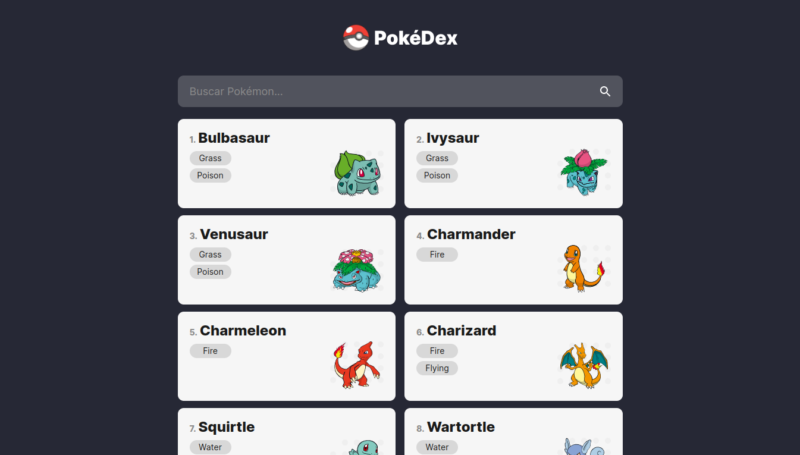

  

  

  

  

## 💻 Projeto

PokéDex desenvolvida com o framework Angular 14 e estilização com Sass CSS, utilizando como base os conhecimentos passados no curso "Curso Angular 2 (v13+) e TypeScript do Básico ao Avançado" feito na Udemy. Utilizando a [PokéAPI](https://pokeapi.co/) para trazer os dados dos Pokémons.

## ✨ Tecnologias e features

- [x] Angular
- [x] Sass CSS
- [x] TypeScript
- [x] [PokéAPI](https://pokeapi.co/)

## 📄 Licença

Esse projeto está sob a licença MIT. Veja o arquivo [LICENSE](.github/LICENSE.md) para mais detalhes.
